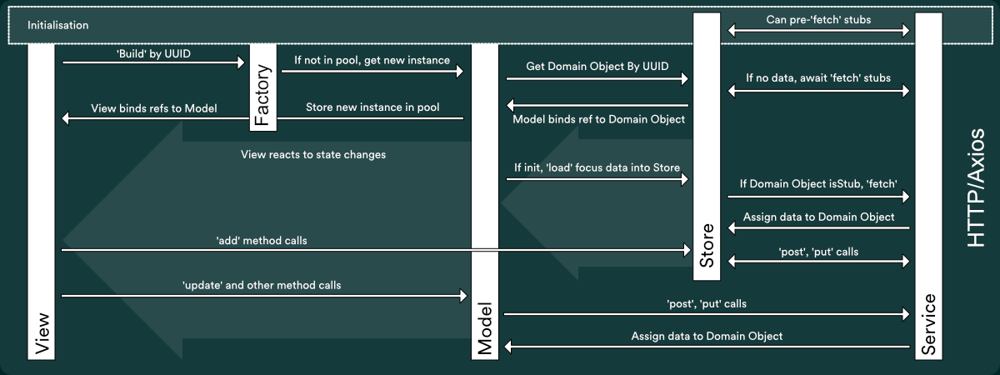
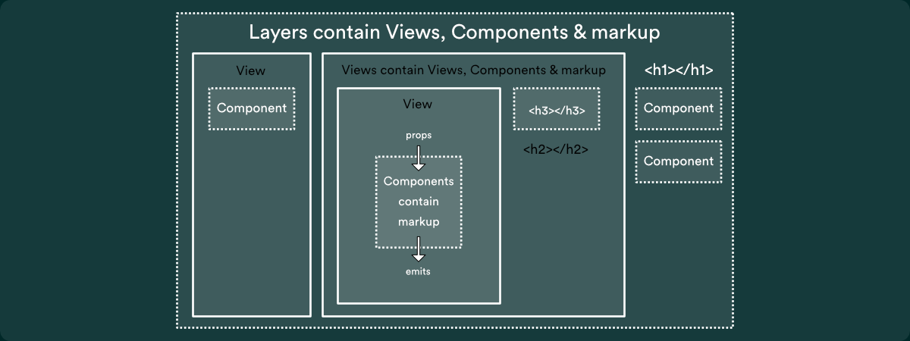
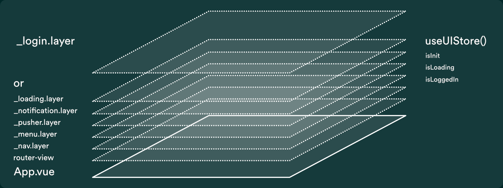

<!--
Hey, thanks for using the awesome-readme-template template.  
If you have any enhancements, then fork this project and create a pull request 
or just open an issue with the label "enhancement".

Don't forget to give this project a star for additional support ;)
Maybe you can mention me or this repo in the acknowledgements too
-->
<div align="center" id="top">
<br />
  
<p>
Documentation for the Vue/Pinia version of the Fabric Flow/Translate UI project
</p>

<!-- Badges -->
<p>
  <a href="https://github.com/Louis3797/awesome-readme-template/graphs/contributors">
    
  </a>
  <a href="">
    
  </a>
  <a href="https://github.com/Louis3797/awesome-readme-template/network/members">
    
  </a>
  <a href="https://github.com/Louis3797/awesome-readme-template/stargazers">
    
  </a>
  <a href="https://github.com/Louis3797/awesome-readme-template/issues/">
    
  </a>
  <a href="https://github.com/Louis3797/awesome-readme-template/blob/master/LICENSE">
    
  </a>
</p>

</div>


<!-- Table of Contents -->
# Table of Contents

- [Getting Started](#getting-started)
    * [Prerequisites](#prerequisites)
    * [DEV](#run-dev)
    * [PREV](#run-prev)
    * [PROD](#run-prod)
- [Tech Stack](#tech-stack)
    * [Core](#tech-stack-core)
    * [Styling](#tech-stack-styling)
    * [Libraries](#tech-stack-libraries)
    * [Development](#tech-stack-development)
- [Organisation - MVVM](#organisation)
    * [Model: Stores & Services](#organisation-model)
    * [ViewModel: Models, Factories & VMs](#organisation-viewmodel)
    * [View: Layers, Views, Forms, Modals & Components](#organisation-view)
    * [Signals: Application-wide event bus](#organisation-signals)
- [Construction](#construction)
    * [index.html, index.css, main.ts & App.vue](#construction-app)
    * [Vue-Router](#construction-vue-router)
    * [ErrorManager](#construction-error-service)
    * [utils & mixins](#construction-utils)
- [Development](#development)
    * [Naming Conventions](#development-naming-conventions)
    * [Plop](#development-plop)
    * [Interfaces](#development-interfaces)
    * [Enums](#development-enums)
    
- [License](#license)

---
<!-- Getting Started -->
# Getting Started

<!-- Prerequisites -->
# Prerequisites

This project uses Yarn as package manager

```bash
 npm install --global yarn
```

Install dependencies

```bash
  yarn
```


<!-- Dev Build -->
## Dev Build

Start Vite.  Development environment with HMR.  Also accepts 'yarn serve'

```bash
  yarn dev
```

<!-- Build Prev -->
## Preview Build

Always run a prev build before committing anything for delivery.  'vue-tsc' will often find issues with types and/or linking across modules that vite will miss.

```bash
  yarn prev
```


<!-- Build Prod -->
## Production Build

You're unlikely to need this at the moment as the deployed build is built on the server.    Also accepts 'yarn build'

```bash
  yarn prod
```
<p align="right">(<a href="#top">back to top</a>)</p>

---

<!-- TechStack -->
# Tech Stack

<!-- TechStackCore -->
## Core
  <ul>
    <li><a href="https://vuejs.org/api/">Vue 3</a></li>
    <li><a href="https://pinia.vuejs.org/introduction.html">Pinia</a></li>
    <li><a href="https://seb-l.github.io/pinia-plugin-persist/">pinia-plugin-persist</a></li>    
    <li><a href="https://axios-http.com/">Axios</a></li>
    <li><a href="https://formkit.com/">Formkit</a></li>    
    <li><a href="https://fusejs.io/">Fuse</a></li>
    <li><a href="https://github.com/pusher/pusher-js">Pusher</a></li>
    <li><a href="https://github.com/Hypercubed/mini-signals">Mini-Signals</a></li>
  </ul>

<!-- TechStackStyling -->
## Styling
  <ul>
    <li><a href="https://tailwindcss.com/">Tailwind CSS</a></li>
    <li><a href="https://daisyui.com/">DaisyUI</a></li>
    <li><a href="https://fontawesome.com/docs">FontAwesome</a></li>
  </ul>

<!-- TechStackLibraries -->
## Libraries
  <ul>
    <li><a href="https://lodash.com/">Lodash</a></li>
    <li><a href="https://vocajs.com/">Voca</a></li>
    <li><a href="https://day.js.org/en/">Day.js</a></li>
    <li><a href="https://github.com/nemtsov/json-mask">json-mask</a></li>    
  </ul>

<!-- TechStackDevelopment -->
## Development
  <ul>
    <li><a href="https://vitejs.dev/">Vite</a></li>
    <li><a href="https://plopjs.com/">Plop</a></li>
  </ul>
<p align="right">(<a href="#top">back to top</a>)</p>

---

<!-- Organisation -->
# Organisation
Fabricate is based mostly on the Model/View/ViewModel (MVVM) pattern and the architecture is heavily informed by the modular state management offered by Pinia and 
the Composition API in Vue 3.  The fairly formal naming conventions enable Plop to be more powerful.

Fabricate attempts to decouple all views and stores from each other, with each store centred on a Domain Object type and each view being the expert in the thing it does/shows.
Data flow is (intended to be) one directional: user requests are sent via method calls from views, via the viewmodel which communicates with Stores and Services.  Changes to the Model, 
assigned by Stores and data Models, are propagated back to the views through bindings.  

Each request also sets up a promise-chain through the system so that as resolution is passed back to the requester each actor on the request has
a chance to respond appropriately with its own .then handler.  
<ul>
<li>Services handle errors.  </li>
<li>Stores handle loading and updating data.  </li>
<li>Models/ViewModels are still Stores but also handle app wide communication, mostly through _ui.store and Signals.</li>
<li>Views only handle events emitted from child components.  They are fire-and-forget by design; they don't 'await', simply making calls to the relevant model and are
only updated reactively by changes to the model.  You CAN wrap that method call in an await if you really need to know when the data is updated but you should do that with a watch.
</li>
</ul>

In this diagram the arrows represent asynchronous calls which pass back a Promise.  Views can be mounted knowing that the data is on its way; whether 
that's already in session memory, has been loaded from localstorage or has yet to even be requested.

<p align="center">

</p>

*** Note ***

Vue and Pinia are extremely flexible.  Fabricate is laid out to be easy to reason about but can only be a recommended set of guidelines.  There's nothing to stop you 
getting a reference to a model, store or service from deep inside a component and using a promise there; everything is a Singleton when you can import it as a const.  Indeed sometimes it's exactly
what you'll want to do, either as a hotfix or prototype; which is why there are no rules against it.  While refactoring I was collapsing everything into a _layer (vm, all the view templates and 
code in a single file) and then dividing that up into Views/Components as required.  This is how I'd approach starting a completely new _layer; shove it all together, make it work then separate 
the concerns.  Tailwind CSS is gold for this. The styles are in the templates so they get copied straight over in a refactor - no faffing about with scoped css or renaming nested BEM sass classes.

This is how I, currently, like to code.  There are no hard and fast rules for a reason but as any fairytale will advise you 'stay on the path or you won't find your way home'.  The only thing you have to lose is your teams' sanity ;)

<p align="right">(<a href="#top">back to top</a>)</p>


<!-- Organisation Model -->
## Model: Stores & Services
_"Model refers either to a domain model, which represents real state content (an object-oriented approach), or to the data access layer, which represents content (a data-centric approach)"_

The Model is the in-memory representation of the bits of the Model on the server that the user is interested in.  
It is divided client-side into pairs of store/service for each of the main domain objects: Application, Pension, Provider etc
These are decoupled so that changes to the transport layer (hopefully) won't need refactoring.
Services are grouped by function as much as domain (email.service, utils.service)
Stores don't have to be related to a service but usually talk to localStorage or encapsulate access to something else e.g. _device.store exposes breakpoints, browser details etc
<p align="right">(<a href="#top">back to top</a>)</p>

### internalAxios/externalAxios
There are two core modules that wrap an instance of Axios each. They abstract away the server url, authentication, service call logging and caching & throttling
```javascript
const _axios = setup({
    baseURL: `${VITE_APP_API_URL}/${VITE_APP_API_VERSION}`,
    timeout: 10000,
    withCredentials: false...

//  ...

// Add a request interceptor
_axios.interceptors.request.use(
    async function (config) {
        // Do something before request is sent
        const token = useUserStore().token;
        config.headers = config.headers || {};
        config.headers.Authorization = `Bearer ${token}`;
        
        return config;
    }...
```
```javascript
const _axios = setup({
    baseURL: `${VITE_APP_DOCUMENT_SERVICE_URL}/${VITE_APP_API_VERSION}`,
    timeout: 10000,
    withCredentials: false,
    headers: {
        'X-API-KEY': String(VITE_APP_DOCUMENT_SERVICE_KEY),
        "Content-Type": "application/json"
    },
```
###### Responsibilities
<ul>
<li>Create axios instances with a baseURL specified in the .env variables</li>
<li>Add auth headers to calls respectively</li>
<li>Cache requests - TODO</li>
<li>Throttle requests - TODO</li>
</ul>

###### Knows about
<ul>
<li>.env variables</li>
<li>internalAxios knows about the _user.store, requesting the current token and setting the auth headers for every call</li>
</ul>
<p align="right">(<a href="#top">back to top</a>)</p>

### Service
Conceptually related functions, grouped in a const module and mapped to server routes.  Services 'fetch', 'add' and 'update' data but can expose any route

```javascript
import { internalAxios } from "./axios";

const _service = {
    fetchEmailTrailByPenUUID: async ({ pen_uuid, }) => await internalAxios.get(`/application/get-email-trail/${pen_uuid}`),
    previewEmail: async (params) => await internalAxios.post(`/email-preview/preview-email`, params),
    sendEmail: async (params) => await internalAxios.post(`/email-preview/send-email`, params),
}

export const emailService = _service
```

###### Responsibilities
<ul>
<li>'fetch' data from the server</li>
<li>Post 'add' and 'update' requests to the server</li>
<li>Specify caching 'maxAge' on per route basis</li>
<li>Return request promises</li>
</ul>

###### Knows about
<ul>
<li>Services send nearly all requests through internalAxios with very specific calls to handle documents through externalAxios</li>
<li>Can populate requests with data from _user.store</li>
</ul>

###### Plop
```bash
'AxiosService'  
path: 'src/_services/{{camelCase class}}.service.ts',
templateFile: 'plop-templates/AxiosService.hbs',
```

<p align="right">(<a href="#top">back to top</a>)</p>

### Store
Core stores are const modules marked with an underscore at the start of their file name and listed in the root of the stores folder (e.g @/_stores/_device.store.ts) They are mostly functional only stores to handle things like browser breakpoints, user token and preferences etc

Domain stores are const modules and are listed in a domain specific folder in the stores folder (e.g @/_stores/pension/pension.store.ts)  They load a collection of domain objects and provide access to this through filters and finds

Domain stores 'load' domain objects.  

```javascript
export interface IPensionState
{
    pensions: IPension[];
}

export const usePensionStore = defineStore(`_pension.store`, {

    //////////////////////////////////////////////////////////////////////////////////////////////////
    //  State
    state: (): IPensionState => ({
        pensions: useCoreStore().pensions,
    }),
```

They expose an init function which is guarded to be only callable once.  This guard is a property added by a Pinia Plugin: INITIALISED which is set after any call to init.  See PiniaBase.ts
```javascript
// main.ts
import { PiniaBase } from "@/_stores/PiniaBase";
```
###### Responsibilities
<ul>
<li>Load a collection of objects by asking a service to fetch the data</li>
<li>Store loaded data in _core.store so that it can be decorated with uuids</li>
<li>Load focus data for domain objects, if stubs are available, and assign to existing reactive objects in the model</li>
</ul>

###### Knows about
<ul>
<li>Stores are usually paired with a specific service but can access any of the services they require</li>
<li>Try and limit knowledge of other stores by only communicating through core stores, particularly _ui.store</li>
</ul>

###### Plop
Would probably use 'Domain Object - Factory/Model/Store/Interface'
```bash
'PiniaRootStore'  
path: 'src/_stores/_{{camelCase class}}.store.ts',
templateFile: 'plop-templates/PiniaStore.hbs'
```
```bash
'Store'  
path: 'src/_stores/{{camelCase class}}/_{{camelCase class}}.store.ts',
templateFile: 'plop-templates/PiniaStore.hbs'
```

<p align="right">(<a href="#top">back to top</a>)</p>

<!-- Organisation ViewModel -->
## ViewModel: Models, Factories & VMs
_"The view model is an abstraction of the view exposing public properties and commands."_

In Fabricate, Views almost always contain and manage their on ViewModel, composing it from references to Model states.  This internal VM can be a grab bag of properties from multiple
Models and View-specific 'computed' properties

<p align="right">(<a href="#top">back to top</a>)</p>

### Factory
Builds instances of Domain Object Models, tracks them in a WeakMap and initialises them once.  This guarantees that all views interested in a specific UUID will receive a reference to the same
object, saves on creating multiple objects and array lookups.  It remains untested but the intention of the WeakMap here is that when Views are unmounted or destroyed they delete their own reference to the model and garbage collection will 
happen automatically when everything stops looking at the data.

```javascript
const pool = new WeakMap<any, StoreGeneric>();

export const PensionFactory = {
    build: ({ pen_uuid, mock, } : { pen_uuid: string, mock?: boolean, }, ):StoreGeneric => {
        const target = pool[pen_uuid]
        if (target)
        {
            return pool[pen_uuid];
        }
        
        const model: StoreGeneric =  newPensionModel({ pen_uuid, mock, })();
        pool[pen_uuid] = model;
        model?.init({ pen_uuid, mock, });
        
        return model;
    }
}
```

###### Responsibilities
<ul>
<li>Create and initialise instances of model objects of a domain object type</li>
<li>Manage a WeakMap pool of domain modal instances so that all views can request the same object</li>
</ul>

###### Knows about
<ul>
<li>A factory is only aware of the Model that it can create</li>
</ul>

###### Plop
Would probably use 'Domain Object - Factory/Model/Store/Interface'
```bash
'Factory'  
path: 'src/_stores/{{camelCase class}}/{{camelCase class}}.factory.ts',
templateFile: 'plop-templates/PiniaFactory.hbs'
```


<p align="right">(<a href="#top">back to top</a>)</p>

### Model
Models are a 'subclass' of a Store; they both have the type StoreGeneric.  While Stores are Singletons accessible through a
constant useXxxStore function, multiple models of a type can exist constructed by Factories through a newXxxStore function instead.

Each Model is a wrapper for a reactive reference to a Domain Object, specified by a UUID, and is the expert on that object.  Any service call made
from the model is easily supplied with any object data required.
```javascript
export interface IApplicationModelState
{
    application: IApplication;
    isMock: boolean;
}

export const newApplicationModel = ({ app_uuid, mock, }: { app_uuid: string, mock?: boolean, }) => defineStore(`application.model?.${app_uuid}`, {
    //////////////////////////////////////////////////////////////////////////////////////////////////
    //  State
    state: ():IApplicationModelState => ({
        application: (mock) ? _cloneDeep(_mockApplication) : reactive(useApplicationStore().getByUUID({ app_uuid, })),
        isMock: mock !== undefined && mock,
    }),
```

###### Responsibilities
<ul>
<li>Encapsulate a Domain Object or list of Domain Objects</li>
<li>Act as a mock for a Domain Object or list, including a mock object that conforms to an interface if required</li>
<li>Manage computed properties based on it's state - getters</li>
<li>Provide the api for updating the Domain Object/s and any supporting functionality</li>
<li>Solely responsible for updating existing data as the result of service calls</li>
</ul>

###### Knows about
<ul>
<li>Models know about Stores and Services</li>
</ul>

###### Plop
Would probably use 'Domain Object - Factory/Model/Store/Interface'
```bash
'Model'  
path: 'src/_stores/{{camelCase class}}/{{camelCase class}}.model.ts',
templateFile: 'plop-templates/PiniaModel.hbs'
```

<p align="right">(<a href="#top">back to top</a>)</p>

### VM
A ViewModel has a one-to-one relationship with a Layer and it's child Views or, in extreme cases, a single View  e.g. '@/stores/dashboard/stats.vm.ts'.

A ViewModel is halfway between a Store and a Model.  It is a singleton so accessible through a useXxxxStore method but manages state and
computed properties for a group of properties.  Views can use them interchangeably with Models. 

Because Layers and Views compose their own internal VM from data models it is rarely necessary to separate their concerns; they can manage their own state 
and calls to the functions of the Model/s they're subscribed to/registered with.  However, for very complex relationships or for layers where the child views need 
to communicate or respond to the same changes, a ViewModel is appropriate.  They can also make things more grok-able; _providers.vm isn't really necessary,
for example, as it mainly wraps a single Store entity but does make the related _providers.layer cleaner.  Another candidate for a VM are situations where the layer and/or views
are turning most of the Model's state into refs and all have a long list of refs; it's cleaner to put the long, complex state in a VM and ref it as _vm.[variable_name] in the template and code

Initially, every layer was going to have a vm that composed models together for the views but that lead to an extra layer of reactivity and 
was actually quite difficult to keep track of.  It's far clearer to have them all listed in the View's logic; it is the expert after all.

###### Responsibilities
<ul>
<li>Manage the display state for complex layers and views</li>
<li>Manage computed properties based on it's state - getters</li>
<li>May provide the api for making specialised calls to the backend</li>
</ul>

###### Knows about
<ul>
<li>ViewModels know about Stores and Services</li>
</ul>

###### Plop
```bash
'ViewModel'  
path: 'src/_layers/{{camelCase parent}}/_{{camelCase class}}.vm.ts',
templateFile: 'plop-templates/PiniaViewModel.hbs'
```

<p align="right">(<a href="#top">back to top</a>)</p>

<!-- Organisation View -->
## View: Layers, Views, Forms, Modals & Components
_"...the view is the structure, layout, and appearance of what a user sees on the screen..."_

<p align="center">

</p>

<p align="right">(<a href="#top">back to top</a>)</p>

### Layer
Layers are conceptually super Views but are really just Views with a more limited remit and a naming convention.  Ideally, a layer is only 
responsible for the layout and styling of its children: Views, Forms, Modals and, at a push, Components.  A 'display' layer should be mostly flexbox ;)

They are always listed at the top of a layer folder as they use the naming convention _[layer name].layer.vue

Many have a one-to-one relationship with a route.

Some _layers are simple enough to not require dividing into Views e.g. _nav.layer.

Layers can be purely functional and may not even have a template.
They don't necessarily require a viewmodel as such and may not reference any stores.
Sound, for example, would be added to the App.vue stack as a _sound.layer with logic in either _ui.store or, more formally, in a dedicated _sound.store
because it's easy to reason about, is consistent with everything else in the app, you get access to the vue component lifecycle hooks and 
the boilerplate can be used to access user preferences, listen for Signals etc.

As mentioned elsewhere, there's nothing to stop you just whacking all the markup and code for a bunch of related functions into a layer and be done e.g.
_ml.layer will need dividing into Views once it's basically functional; it's easier to cobble together stateful relationships in a single file but it's harder to maintain and extend in the long run.  

There is an argument for using the layers to build models from the factories and then utilising Vue3's Provide/Inject mechanism to allow child Views access to the common model.
I think this is probably overkill; not all children will require access and they're all capable of requesting the model from the factory whether that's by 
reading the urlQuery themselves (or by prop from the layer but preferably not).  It also makes Views more self-contained; you can move/duplicate Views between layers with very little fuss.


###### Responsibilities
<ul>
<li>Is considered required.  Forms the entry point for all routes and functional layers</li>
<li>Can have the same responsibilities as a View (state, getters, styling, event handling, Signals)</li>
<li>Preferably only responsible for layout and providing fallthrough attributes and styling to child Views</li>
</ul>

###### Knows about
<ul>
<li>Layers should only know about styling and their children but act just like a View otherwise</li>
</ul>

###### Plop
```bash
'Layer'  
path: 'src/_layers/{{ kebabCase class }}/_{{ kebabCase class}}.layer.vue',
templateFile: 'plop-templates/VueLayer.hbs'
```

<p align="right">(<a href="#top">back to top</a>)</p>

### View
As Models are the units of the ViewModel, Views are the building blocks of the, ahem, View.  Views can be reusable but in my experience they are rarely any more reusable than being easy
to drop into multiple layers.  Generally you need a View for a specific purpose on a specific page.  A View is a little, self-contained application in its own 
right.  Views shouldn't receive props - they can get all the data they need from the ViewModel or the display related Stores (_device, _ui).  Equally Views shouldn't emit events; as far as
the View is concerned nothing exists outside of itself.  Mutations are checked and made to the Model as a result of calls to the backend and propagated to anything interested reactively.

Don't make views a 'card'.  Specify that layout and styling in the parent container. Try to keep any styling of content out of the root element of a View's template;  base styles should
be provided via fallthrough attributes.  It's often the case that the only styles required on the entry point div is 'w-full h-full' so that it fills whatever space is specified 
by the parent.  Beyond this, most styles can be got from the tailwind theme - TODO
```javascript
//  get the target domain object UUID from the url.  This is encapsulated by _ui.store to ensure type safety and because the Vue-Router itself was difficult to get up-to-date params from
const app_uuid = String(useUIStore().urlQuery.app_uuid);

//  Build a Model to wrap the domain object.  The View doesn't care if it already exists or still needs be populated
let _appModel: StoreGeneric =  ApplicationFactory.build({
    app_uuid,
    mock: false,
});

//  Cherrypick the bits of the Model the View requires
const {
    application,
    employmentList,
} = storeToRefs(<StoreGeneric>_appModel);
```

###### Responsibilities
<ul>
<li>Display the data, views and components for the subject they are an expert in</li>
<li>Give props to components, listen for emitted component events and handle them</li>
</ul>

###### Knows about
<ul>
<li>Views know about Model, Factories and VMs</li>
<li>Views build their own slice of the ViewModel from data models and, sometimes, a separate _vm</li>
<li>Views can know about Stores and Services if the View is simple and requires direct communication with the backend but you should favour the Models' APIs as they encapsulate data</li>
<li>Release references to models when unmounted so that Factories can do garabage collection - TODO</li>
<li>Listen for/handle Signals, particularly LOGOUT - TODO</li>
</ul>

###### Plop
```bash
'View'  
path: 'src/_layers/{{camelCase parent}}/{{pascalCase class}}View.vue',
templateFile: 'plop-templates/VueView.hbs'
```

<p align="right">(<a href="#top">back to top</a>)</p>

### Form/FormGroup
Forms are a specialised type of View.  They usually receive a reference to a Model as a prop but could call a Factory if a UUID is supplied instead.  They also receive a target object
for the form's initial state.  This is because for a new object (new address, new employment) the Model may be a mock object or may be optional in a FormGroup; the parent form will handle 
calls to the Model.

All Forms receive/default an action prop of type FORM_ACTION.ADD | FORM_ACTION.EDIT.  They should also provide an optional onClose callback prop; when used inside ModalComponent there is
no idea of parent and the callback should be called if it is set.

FormGroups are further specialised in that they can be  used as a Form or as a group in a larger form.  They have an additional prop, called 'type', that defaults to 'group'

There is an argument for everything being a FormGroup that defaults to 'form' and just drop the differentiation; just have Forms that can be either.
```javascript
interface IAddressFormGroupProps
{
    model?: StoreGeneric;
    address: IAddress;
    action: FORM_ACTION;
    type?: "group" | "form";
    onClose?: Function;
}

const props: Readonly<IAddressFormGroupProps> = withDefaults(defineProps<IAddressFormGroupProps>(), {
    model: undefined,
    address: undefined,
    action: FORM_ACTION.EDIT,
    type: "group",
    onClose: undefined,
});
```

###### Responsibilities
<ul>
<li>Must have onFormSubmit and getFormData functions.</li>
<li>Emit a CLOSE event.  getFormData should be publicly exposed</li>

```javascript
const emit = defineEmits([ EMIT.CLOSE, ]);

defineExpose({
    getFormData,
})
```

<li>Formkit validation is done by inline rules</li>
</ul>

###### Knows about
<ul>
<li>Forms & FormGroups only know about themselves and perhaps the model they interact with</li>
</ul>

###### Plop
No plop template is provided for Forms

<p align="right">(<a href="#top">back to top</a>)</p>

### Component
```javascript

```
Try to keep any styling of content out of the Component's template;  base styles should be provided by a layer/view via fallthrough attributes.  It's often the case that the only
styles required on the template entry point div is 'w-full h-full' so that it fills whatever space is specified by the parent.  Beyond this most styles can be got from the tailwind theme - TODO
###### Responsibilities
<ul>
<li>Display content based on props</li>
<li>Emit events</li>
<li>Can get references from Factories/Models but if you really need to do that it's probably a View.  Consider making the bit that really needs to be reusable a Component inside
a new View to contain it</li>
</ul>

###### Knows about
<ul>
<li>Should only really know about itself</li>
</ul>

###### Plop
```bash
'VueComponent'  
path: 'src/_components/{{pascalCase class}}Component.vue',
templateFile: 'plop-templates/VueComponent.hbs'
```

<p align="right">(<a href="#top">back to top</a>)</p>

### Modal
The ModalComponent is primarily used in concert with Forms.  Modals are specified inside the View that they are relative to.
```javascript
<ModalComponent v-if="formAction" @close="onModalClose">
  <template #title>
    {{ _titleCase(formAction) }} Pension
  </template>
  <template #content>
    <PensionForm
        :pen_model="formModel"
        :app_uuid="app_uuid"
        :action="formAction"
        :onClose="onModalClose"
        :showProviderSwitch="true"
    ></PensionForm>
  </template>
</ModalComponent>
```

ModalForms rely on two standardised Refs and may accept a third Ref for editable content.  The Modal is displayed while the FORM_ACTION is not null and the Modal title
can be populated with the FORM_ACTION.  Note that the formAction ref is set last to open a Modal and then set to null to hide.

```javascript
const formAction: Ref<FORM_ACTION | null> = ref(null);
const formModel: Ref<StoreGeneric> = ref(<StoreGeneric>{});
const formEmployment: Ref<IEmployment | null> = ref(null);

// later
    
function onEmploymentEdit(employment) {
    formEmployment.value = employment;
    formModel.value = _appModel;
    formAction.value = FORM_ACTION.EDIT
}
```

###### Responsibilities
<ul>
<li>Add/Remove itself from the DOM</li>
<li>Teleport itself to the body tag</li>
<li>Provide slots for title and content</li>
<li>Provide an onClose callback function</li>
</ul>

###### Knows about
<ul>
<li>A Modal only knows about itself.  It's a collection of slots with styling and absolute positioning inside</li>
</ul>

###### Plop
No plop template is provided for Modal

<p align="right">(<a href="#top">back to top</a>)</p>


<!-- Organisation Signals -->
### Signals: Application-wide event bus

The challenge with Signals is to not use them for everything.  If Vue didn't provide emits I'd be using Signals for event dispatch from Components.

Signals are for true Application-wide events that can be sent from or received anywhere.  LOGIN.  LOGOUT.  PUSHER_NOTIFICATION.  SOME_BRAINMELTING_ERROR

The temptation to create a Signal to communicate between two distant Views or Stores can be immense.  Pinia's reactivity can handle that.  Just don't do it.
```javascript
import MiniSignal from 'mini-signals';

export const Signals =
{
    ERROR: new MiniSignal(),
    LOGIN: new MiniSignal(),
    LOGOUT: new MiniSignal(),
    NOTIFICATION: new MiniSignal(),
    PUSHER_NOTIFICATION: new MiniSignal(),
}
```

###### Responsibilities
<ul>
<li>Allow actors to subscribe</li>
<li>Dispatch, usually with a payload</li>
</ul>

###### Knows about
<ul>
<li>Signals know about their subscriptions</li>
</ul>
<p align="right">(<a href="#top">back to top</a>)</p>

---

<!-- Construction -->
# Construction

How the bits fit together and how it's all bootstrapped

<p align="center">

</p>

<!-- Construction App -->
## index.html, index.css, main.ts & App.vue

Pretty much what you'd expect but worth commenting on...

*index.html* - contains the site's background styles

*index.css* - Refer to the tailwind docs.  Provides a set of seven border style rules in rainbow colours for quickly identifying divs in markup.  'dev1', 'dev2' etc.
Any other classes in here will eventually move into a tailwind theme but this is where you can drop in quick, general rules for testing.  Actual fabric rules should be prefixed with 'fab-'.
At time of writing the only actual rule is fab-truncate

*main.ts* - A fairly typical vue main! 
<ul>
<li>Creates the FontIconLibrary</li>
<li>Creates App</li>
<li>Creates PiniaBase</li>
<li>Attaches the App error handler to the ErrorManager</li>
<li>Initialises some core stores</li>
</ul>
Of note though is the global interface ImportMeta; any changes to the environment variables need to be reflected here or Typescript will be unhappy

```javascript
//Type override for HMR so TS doesn't complain
declare global {
    interface ImportMeta {
        hot: {
            accept: (params) => void;
            dispose: (params) => void;
        };
        env: {
            MODE: string;
            DEV: string;
            PROD: string;
            VITE_APP_API_URL: string;
            VITE_APP_API_VERSION: string;
            VITE_APP_PUSHER_APP_KEY: string;
            VITE_APP_DOCUMENT_SERVICE_KEY: string;
            VITE_APP_DOCUMENT_SERVICE_URL: string;
            VITE_APP_HUBSPOT_URL: string;
            VITE_APP_PTS_URL_1: string;
            VITE_APP_PTS_URL_1_PAGE: string;
            VITE_APP_PTS_URL_2: string;
        };
    }
}
```

<p align="right">(<a href="#top">back to top</a>)</p>

<!-- Construction Vue-Router -->
## Router.ts & _ui.store 
See the Vue-Router documentation.  

'@/router/Router.ts' is a wrapper for the vue-router class and comprises an array of IRoute objects, a navigation guard that checks user access on a route change and a 'getter' function that returns
an array of routes with a positive integer menu id, sorted by said ids.  Menu additions, subtractions and reordering can all be done by simply changing the ids.

_ui.store is how the rest of the application communicates with the router and centralises the showing and hiding of the loading layer.  Note that access
to the function requires an enumerated value.
```javascript
async goRoute(name: ROUTE_NAMES, query:LocationQueryRaw, )
{
    this.showLoading(name);
    await router.push({ name, query, });
    this.isLoading = false;
},
```

It also standardises currentRoute and urlQuery access through two 'getters' and enforces type safety with interfaces.
```javascript
//  @ts-ignore: vue-router weirdness
currentRoute: (state): IRoute => {
    const current = useRouter().currentRoute.value;
    const route: any = _find(routes, { 'name': current.name });
    return {
        component: route?.component,
        fontIconType: String(route?.fontIconType),
        menu: route?.menu,
        name: route?.name,
        fullPath: String(route?.fullPath),
        path: String(route?.path),
        title: String(route?.title),
    }
},
//  @ts-ignore: vue-router weirdness
urlQuery: (state): IUrlQuery => {
    const query = useRouter().currentRoute.value.query;
    return {
        app_uuid: String(query.app_uuid),
        pen_uuid: String(query.pen_uuid),
        emp_uuid: String(query.emp_uuid),
        prv_uuid: String(query.prv_uuid),
        type: String(query.type),
    }
},
```

<p align="right">(<a href="#top">back to top</a>)</p>

<!-- Construction ErrorManager -->
## ErrorManager
The src/ErrorManager.ts class provides static methods for the reporting of errors from different parts of Fabricate.  This allows them to be styled differently
and a function to find the stack in Vue errors.  TODO - it basically works, but it could do with a bit of love in how it's used and what it outputs.

<p align="right">(<a href="#top">back to top</a>)</p>

<!-- Construction Utils -->
## utils & mixins
I was using utils.ts to migrate functions from the mixins files during the refactor to track which ones are still used.
I think the utils approach is cleaner here and mixins are strictly something else entirely and no longer recommended.
So eventually all mixins should become utils

<a href="https://vuejs.org/api/options-composition.html#mixins">https://vuejs.org/api/options-composition.html#mixins

I favour this form of import as it makes it clear later that the function isn't local.  This is also why utils aren't in separate files with an index.ts

```javascript
import * as utils from '@/utils';

//

const whatever = utils.somethingRepetitive(_model.someData)
```

<p align="right">(<a href="#top">back to top</a>)</p>

---

<!-- Development -->
# Development

There are a few topics that mostly fit into the DevX side of things...
<!-- Development Naming Conventions -->
## Naming Conventions
Underscores are used in file names to differentiate things as 'core' examples of their type e.g. stores without a matching factory and model are core stores like _ui.store.  They also 
get listed first alphabetically in file lists so are used to mark 'root' files in a folder e.g. _pension.layer

Underscores are used with imported lodash functions.  This is a holdover from an earlier project where treeshaking was done with a plugin and lodash functions were converted from 
the form _each by babel.  It retains the lodash format to provide an alias for the import and then hints that it is an import when it is used.
```javascript
import {
    first as _first,
    forOwn as _forOwn,
    last as _last,
    map as _map,
    remove as _remove,
} from 'lodash-es'

//  ...

const mapped = _map(someArray, () => blah)
```

Underscores are also used in code to denote privacy of members.  Model and VM references are marked with an underscore.  It denotes something local to the file.  These will 
become # as support for private fields increases but remember that everything in a Vue object is private unless defined as exposed.

props are denoted in code by the 'props.' keyword.  Refs must have their value selected somehow, either with the .value keyword or using the Vue 3 unref() function.  There is a proposed sugar
syntax for this in Vue 3, using $, but I like the clarity of the trailing .value.  Its obvious what type each of these things are and where you will find them initialised 
```bash
_localSomething, _model, _vm, _store, props.something & something.value
````

<!-- Development Plop -->
## Plop
The main file types in Fabricate can, and should, be generated from plop templates.  Plop.js is included as a devDependency, has a root plopfile.js 
which is a collection of scripts and a folder of handlebars templates 'project root/plop-templates'.  Scripts populate templates, save them in the correct location and
update an index.ts if appropriate.  They do a lot of the wiring up for you, particularly 'Domain Object - Factory/Model/Store/Interface' which bootstraps a whole Domain Object file structure 

<p align="right">(<a href="#top">back to top</a>)</p>

<!-- Development Interfaces -->
## Interfaces/Types
All the main entities and object types have an interface.  These are listed in separate files (one per interface), exported from a manifest index.ts file and imported through '@/types'.  It's 
easiest to plop new Interfaces as it adds the new file to the index for you.

###### Plop
Often added by using 'Domain Object - Factory/Model/Store/Interface' 
```bash
'Interface'  
path: 'src/types/I{{ pascalCase class}}.ts',
templateFile: 'plop-templates/Interface.hbs'
```

<p align="right">(<a href="#top">back to top</a>)</p>

<!-- Development Enums -->
## enums
Typescript enums provide type safety, certainty, discoverability and remove "magic strings".  

'@/enum' contains enumerations for application and pension statuses and closed reasons.

All the ROUTE_NAMES are specified for communication with the vue-router.

UUID specifies all the different uuid's e.g. UUID.APP === "app_uuid".

Components should always specify their emits with EMIT.ts
```javascript
const emit = defineEmits([ EMIT.ASSIGN, EMIT.SELECT, EMIT.DUPLICATION]);

// ...

function updateParent(application) {
    emit(EMIT.UPDATE, application);
}
```

<p align="right">(<a href="#top">back to top</a>)</p>


<!-- license -->
# License

Distributed under the no License. See LICENSE.txt for more information.


